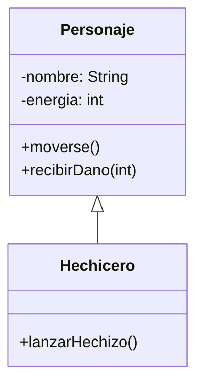
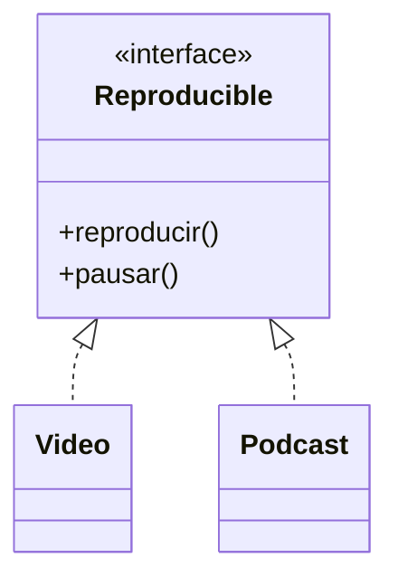
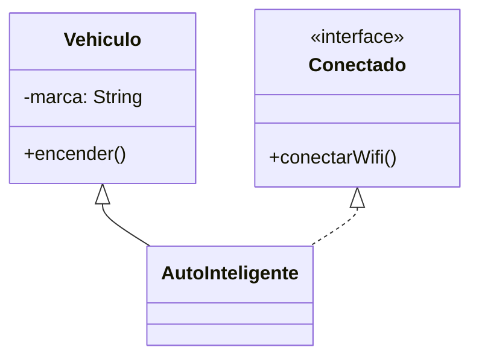
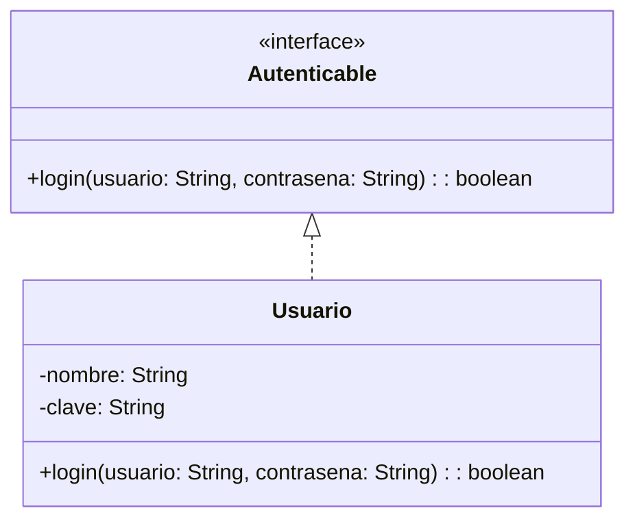
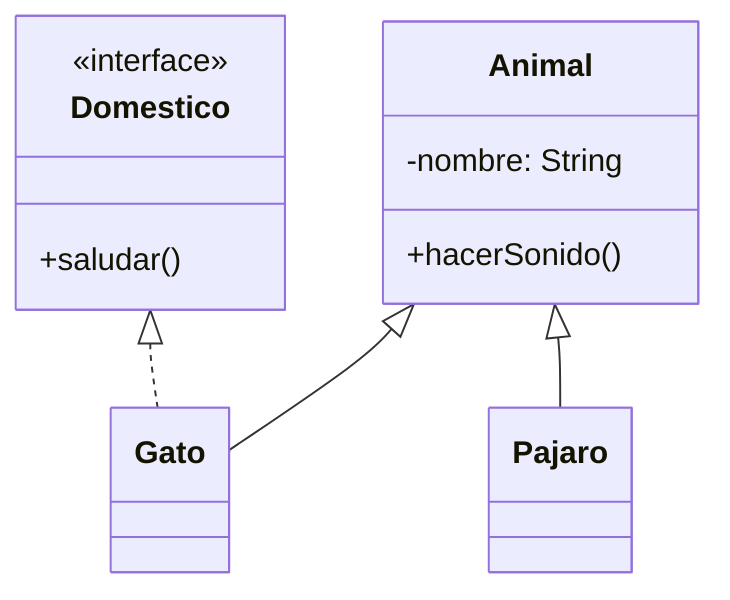

# Clase 3: Herencia e Interfaces en Java

## ✨ Parte Teórica

### 🔹 Herencia
La **herencia** es un mecanismo que permite crear una nueva clase a partir de otra existente. La nueva clase hereda los atributos y comportamientos (métodos) de la clase base.

#### Ventajas:
- Reutilización de código
- Jerarquías lógicas de clases.
- Mantenimiento más fácil.

```java
// Ejemplo: Animal -> Perro
public class Animal {
    public void hacerSonido() {
        System.out.println("Algún sonido animal");
    }
}

public class Perro extends Animal {
    public void hacerSonido() {
        System.out.println("Guau guau");
    }

    public void moverCola() {
        System.out.println("El perro mueve la cola");
    }
}
```

### 🔹 Interfaces
Una **interfaz** es una especie de contrato: una clase que la implementa debe definir todos sus métodos.

#### Ventajas:
- Facilita la abstracción y la programación por contratos.
- Es muy útil para trabajar con herencia múltiple de comportamientos.

```java
public interface Reproducible {
    void reproducir();
    void pausar();
}

public class Cancion implements Reproducible {
    public void reproducir() {
        System.out.println("Reproduciendo canción");
    }
    public void pausar() {
        System.out.println("Cancion pausada");
    }
}
```

---

## 💡 Parte Práctica: Ejercicios Progresivos

### 🎮 Ejercicio 1 – "Personajes de un Juego"
**Objetivo:** Entender herencia mediante clases de personajes.

```java
public class Personaje {
    private String nombre;
    private int energia;

    public Personaje(String nombre) {
        this.nombre = nombre;
        this.energia = 100;
    }

    public void moverse() {
        System.out.println(nombre + " se mueve");
    }

    public void recibirDano(int cantidad) {
        energia -= cantidad;
        System.out.println(nombre + " recibe daño. Energía: " + energia);
    }
}

public class Hechicero extends Personaje {
    public Hechicero(String nombre) {
        super(nombre);
    }

    public void lanzarHechizo() {
        System.out.println(getNombre() + " lanza un hechizo");
    }
}
```



---

### 🌟 Ejercicio 2 – "Medios de Reproducción"
**Objetivo:** Usar interfaces para abstraer comportamientos.

```java
public interface Reproducible {
    void reproducir();
    void pausar();
}

public class Video implements Reproducible {
    public void reproducir() {
        System.out.println("Reproduciendo video...");
    }

    public void pausar() {
        System.out.println("Video pausado.");
    }
}

public class Podcast implements Reproducible {
    public void reproducir() {
        System.out.println("Reproduciendo podcast...");
    }

    public void pausar() {
        System.out.println("Podcast pausado.");
    }
}
```



---

### 🚀 Ejercicio 3 – "Vehículos Inteligentes"
**Objetivo:** Combinar herencia e interfaces

```java
public abstract class Vehiculo {
    protected String marca;

    public Vehiculo(String marca) {
        this.marca = marca;
    }

    public abstract void encender();
}

public interface Conectado {
    void conectarWifi();
}

public class AutoInteligente extends Vehiculo implements Conectado {
    public AutoInteligente(String marca) {
        super(marca);
    }

    public void encender() {
        System.out.println("Encendiendo auto " + marca);
    }

    public void conectarWifi() {
        System.out.println("Auto conectado al WiFi");
    }
}
```



---

### 🚪 Ejercicio 4 – "Usuario Autenticable"
**Objetivo:** Práctica de interfaces con login

```java
public interface Autenticable {
    boolean login(String usuario, String contrasena);
}

public class Usuario implements Autenticable {
    private String nombre;
    private String clave;

    public Usuario(String nombre, String clave) {
        this.nombre = nombre;
        this.clave = clave;
    }

    @Override
    public boolean login(String usuario, String contrasena) {
        return this.nombre.equals(usuario) && this.clave.equals(contrasena);
    }
}
```



---

### 🏜 Ejercicio Final – "Animales y Sonidos"
**Objetivo:** Integrar herencia, polimorfismo e interfaces

```java
public abstract class Animal {
    protected String nombre;
    public Animal(String nombre) {
        this.nombre = nombre;
    }
    public abstract void hacerSonido();
}

public interface Domestico {
    void saludar();
}

public class Gato extends Animal implements Domestico {
    public Gato(String nombre) {
        super(nombre);
    }

    public void hacerSonido() {
        System.out.println("Miau");
    }

    public void saludar() {
        System.out.println(nombre + " se frota en tu pierna");
    }
}

public class Pajaro extends Animal {
    public Pajaro(String nombre) {
        super(nombre);
    }

    public void hacerSonido() {
        System.out.println("Pío pío");
    }
}
```


