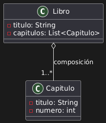
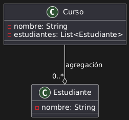

# Relaciones entre Clases: Composición y Agregación

## Conceptos de la clase

En programación orientada a objetos, **la relación entre clases** es fundamental para estructurar programas complejos de manera comprensible y mantenible. Dos de las formas más importantes de relación son **composición** y **agregación**:

- **Composición**: Es una relación **fuerte** donde una clase contiene a otra y **se hace responsable de su ciclo de vida**. Si la clase contenedora se destruye, también lo hacen sus componentes. Ejemplo: un *Libro* está compuesto por *Capítulos*. Si eliminamos el libro, sus capítulos también desaparecen.

- **Agregación**: Es una relación **débil**, donde una clase contiene a otra pero **no es dueña de su ciclo de vida**. Ejemplo: un *Curso* puede tener *Estudiantes*, pero si el curso se elimina, los estudiantes no necesariamente desaparecen.

### Diagrama de Clase: Composición

### Diagrama de Clase: Agregación

---
# Ejercicios progresivos y didácticos

Estos ejercicios están diseñados para permitirte **descubrir la diferencia entre composición y agregación**.

---

### 🧩 Ejercicio 1: "Robots ensamblados" (Composición)

**Contexto**: Un robot está compuesto por varias *Piezas* que lo hacen funcionar: una *CPU*, *brazos*, *piernas*, etc. Si el robot se destruye, sus piezas también dejan de existir.

**Objetivo**: Implementar la clase `Robot` que contiene objetos de tipo `Pieza`. Usa un `ArrayList` para almacenar las piezas.

**Puntos clave**:
- `Robot` crea sus piezas internamente (**relación de composición**).
- Eliminar el `Robot` implica que las piezas no deben seguir existiendo.

---

### 🧠 Ejercicio 2: "Una mente, muchos pensamientos" (Composición)

**Contexto**: Una clase `Mente` contiene múltiples `Pensamiento`. Si se borra la mente, sus pensamientos desaparecen.

**Objetivo**: Modelar esta relación donde los pensamientos no tienen sentido sin la mente.

**Extensión creativa**: cada `Pensamiento` puede tener una *intensidad* y un *tipo* (positivos, negativos, neutrales).

---

### 🌍 Ejercicio 3: "Planeta con ciudades" (Agregación)

**Contexto**: Un `Planeta` tiene varias `Ciudad`, pero estas pueden existir aunque el planeta sea eliminado del sistema (por ejemplo, podrían moverse a otro planeta virtual 😄).

**Objetivo**: Implementar clases `Planeta` y `Ciudad` donde las ciudades pueden existir independientemente.

**Puntos clave**:
- Se debe poder reutilizar ciudades entre planetas (diseña pensando en *referencias compartidas*).
- Usa una lista externa de ciudades y asígnalas a diferentes planetas.

---

### 🏰 Ejercicio 4: "Reinos mágicos y magos" (Agregación)

**Contexto**: Un `ReinoMagico` tiene una lista de `Mago`, pero cada `Mago` puede visitar varios reinos.

**Objetivo**: Modelar **agregación** con objetos compartidos entre múltiples clases.

**Extensión opcional**:
- Cada `Mago` puede tener una *habilidad especial* y un *nivel*.
- Agrega una función para mover magos entre reinos mágicos.

---

### 🧪 Ejercicio 5: "Científicos y Experimentos" (Mixto: composición y agregación)

**Contexto**: Cada `Científico` puede realizar múltiples `Experimento`. Algunos experimentos son internos (privados del científico) y otros son públicos (compartidos con otros científicos).

**Objetivo**: Distinguir claramente entre **composición y agregación** en un mismo ejercicio:

- **Composición**: los experimentos privados no deben existir fuera del científico.
- **Agregación**: los experimentos públicos pueden ser compartidos entre científicos.

---

### 🧙‍♂️ Ejercicio 6: "El grimorio de hechizos" (Composición total)

**Contexto**: Un `Grimorio` contiene *hechizos* que se olvidan si el libro se destruye.

**Objetivo**: Modelar la **composición** con propiedades avanzadas:

- Cada `Hechizo` tiene *nombre*, *nivel de poder*, y *categoría*.
- El `Grimorio` puede lanzar todos los hechizos registrados.

**Sugerencia para clase**: Representar la destrucción del `Grimorio` con la eliminación de los objetos de hechizos en memoria (o simplemente limpieza de la lista).

---

### 🔗 Ejercicio 7: "Red social de mascotas y cuidadores" (Agregación compleja)

**Contexto**: Las `Mascota` pueden tener múltiples `Cuidador`, y estos cuidadores pueden encargarse de varias mascotas.

**Objetivo**:
- Crear una red de relaciones *muchos-a-muchos* usando **agregación**.
- Agregar funciones para *"asignar cuidador"*, *"ver mascotas de un cuidador"*, etc.

**Extensión para gamificación**:
- Otorga *puntos* por cada mascota cuidada.
---

